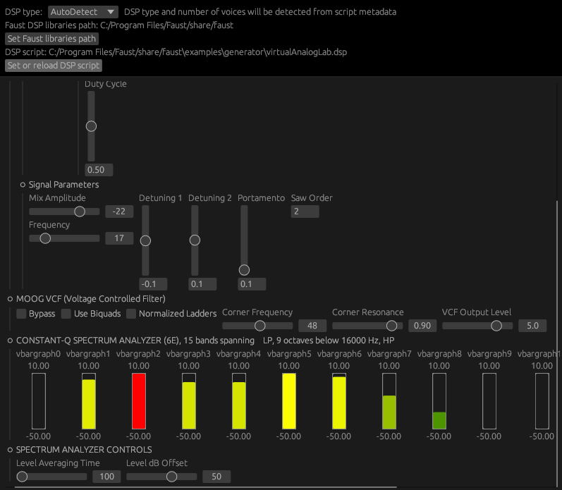

# nih-faust-jit

A plugin to load Faust dsp files and JIT-compile them with LLVM. Limited to
stereo audio (DSP scripts with more than 2 input/ouput chans will be refused).
The selected DSP script is saved as part of the plugin state and therefore is
saved with your DAW project. A two-part GUI is provided:

- Select which script to load and where to look for the Faust libraries that
this script may import
- Tweak the parameters described in the script (shown as various `egui` widgets)

Both effect and instrument DSPs are supported, with MIDI notes and CCs in both
cases. The DSP script type is normally detected from its metadata. E.g. if the
script contains a line like:

`declare options "[midi:on][nvoices:12]";`

then the script will be considered to be an instrument with `12` voices of
polyphony. But you can override this via the GUI to force the DSP script type
and number of voices: this is notably useful for scripts that describe
instruments but do not contain a `[nvoices:xxx]` metadata.

## UI



- DSP widgets are shown in a two-directional scrollable panel (you can also
  left-click on empty space and drag to pan around)
- `v`/`h`/`tgroup`s are implemented as foldable containers
- double-click on any slider's label to reset it to its default value
- hover a bargraph to see its current value

## Building

First install [Rust](https://rustup.rs/) and [Faust](https://faust.grame.fr/downloads/).

For now, Faust paths need to be provided through environment variables at build
time:

- `FAUST_LIB`: which `libfaustXXX` to link with. By default it statically links
  with `libfaustwithllvm` in order to generate a self-contained plugin (which is
  more convenient if you are on Windows, as else you would need extra setup so
  the plugin can find Faust and llvm DLLs at runtime). Just set it to `"faust"`
  if you are on OSX or Linux and want to dynamically link with a regular system
  installation of Faust and llvm (dynamic linking is cargo's default, and
  shouldn't be a problem there)
- `FAUST_LIB_PATH`: where to look for the faust static/dynamic library
- `FAUST_HEADERS_PATH`: where to look for the Faust C/CPP headers
- `DSP_LIBS_PATH`: where the plugin should look by default for the [Faust DSP
  libraries](https://faustlibraries.grame.fr/), so your script can import e.g.
  `"stdfaust.lib"`. This can then be overriden at runtime with the plugin's GUI

You can set these env vars via command line, or edit the `.cargo/config.toml`
before building. You may need to run `cargo clean` after changing them so new
values are taken into account. Check `.github/workflows/rust.yml` to see e.g.
how these are overriden for building on Ubuntu.

Then, you can compile and package the VST3 and CLAP plugins with:

```shell
cargo xtask bundle nih_faust_jit --release
```

Running the standalone version of the plugin is just:

```shell
cargo run --release
```

## Known shortcomings

- Scripts are reloaded only when clicking on the `Set or reload DSP script`
  button. Therefore, anytime you modify something in the top panel (ie. things
  related to how the DSP should be loaded), don't forget to manually reload the
  script (just re-select the same file in the file picker).
- Volume can get high quickly when using polyphonic DSPs, because Faust voices
  are just summed together. The plugin exposes a Gain parameter to the host.
  Don't forget to use it if your instrument script doesn't perform some volume
  reduction already.
- Parameters changed via the GUI widgets are not saved in the plugin's state.
  They will return to the default value they have in the script when the
  plugin is reloaded.
- Metadata (units, style, etc) for widgets are not taken into account so far.

## Crates

The main crate containing the plugin is `nih_faust_jit`. Parts of its logic are
exposed as lower-level crates, that could be reused in other projects:

**`faust_jit`** defines the `SingletonDsp` type. It wraps the part of the
`libfaust` API that is needed to:

- load an effect or instrument DSP from a script,
- process audio buffers with it,
- extract the information needed to build a GUI that can tweak the DSP's
  internal parameters (represented as the `DspWidget` type).
  
`faust_jit` is related to [rust-faust](https://github.com/Frando/rust-faust),
but `rust-faust` deals only with static compilation of DSP scripts to Rust code.
The `faust_jit` crate is not limited to stereo DSP scripts (only the plugin is).

**`faust_jit_egui`** draws an `egui` GUI from the `DspWidget`s.
